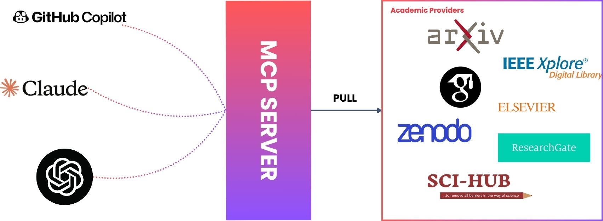

# MCP Paper Finder 📚🔍

A modular, extensible Model Context Protocol (MCP) server for searching, downloading, and reading academic papers from multiple sources, including arXiv, Zenodo, bioRxiv, medRxiv, CrossRef, Google Scholar, ResearchGate, Sci-Hub, and Elsevier.



## Features ✨

- **Unified Search** 🔎: Query multiple academic sources with a single interface.
- **Download PDFs** 📥: Download papers (when available) from supported sources.
- **Read Papers** 📖: Extract and return text from downloaded PDFs (where supported).
- **MCP Compatible** 🤝: Works as a local MCP tool for Claude, Open Interpreter, and other MCP clients.
- **Extensible** 🛠️: Easily add new sources or tools.

## Supported Sources 🌐

- [arXiv](https://arxiv.org)
- [Zenodo](https://zenodo.org)
- [bioRxiv](https://www.biorxiv.org)
- [medRxiv](https://www.medrxiv.org)
- [CrossRef](https://www.crossref.org)
- [Google Scholar](https://scholar.google.com)
- [ResearchGate](https://www.researchgate.net)
- [Sci-Hub](https://sci-hub.st)
- [Elsevier](https://www.elsevier.com) (requires API key)

## Quick Start 🚀

You can run MCP Paper Finder in two ways:

### 1. Run with Docker (Recommended) 🐳

Add the Docker run command (or a wrapper script) as your MCP tool path in your MCP client. Feel free to add `env` variable in the env section. Env variables are presented in `.env.example`.

```sh
"mcpServers": {
  "paper-finder": {
    "command": "docker",
    "args": [
        "run",
        "--rm",
        "-i",
        "-e",
        "DOTENV_CONFIG_QUIET=true",
        "mcp-paper-image"
    ],
    "env": {
        "LOCALAPPDATA": "C:\\Users\\wsial\\AppData\\Local",
        "ProgramData": "C:\\ProgramData",
        "ProgramFiles": "C:\\Program Files"
        "ELSEVIER_API_KEY": "your API KEY" #OPTIONAL
      }
  }
}
```

### 2. Run Locally 💻

```sh
npm install
npm run build
```

- Create `.env` file and add the environment variables presented in `.env.example`

Then, add the path to your built entry point (e.g., `node ./build/index.js`) as a local tool in your MCP client (such as Claude or Open Interpreter).

```json
"paper-finder": {
    "command": "node",
    "args": [
    "ABSOLUTE/PATH/TO/MCPDIRECOTRY/build/index.js"
     ]
}
```

## Testing 🧪

Run all tests with:

```sh
npm test
```

## Project Structure 🗂️

```
src/
  index.ts                # MCP server entry point
  providers/              # Source-specific search/download/read logic
  tests/                  # Jest test cases for each provider
  types/                  # Shared type definitions
```

## Adding New Sources ➕

1. Implement a new provider class in `src/providers/`.
2. Register it as a tool in `src/index.ts`.
3. Add tests in `src/tests/`.

## Demo


## License 📜

[ISC](LICENSE)

---

**Note:** This project is for research and educational purposes. Respect the terms of service and copyright policies of each data provider.